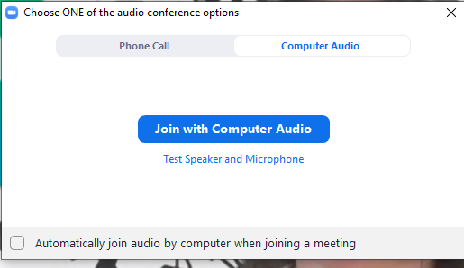
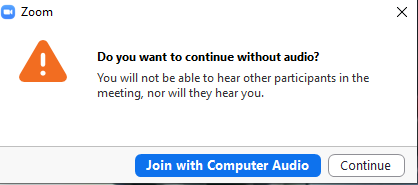

# Hyland + Boys & Girls Club
Thank you for participating in this program!

## Joining the Zoom
To participate, please join the Zoom meeting by clicking [this link](https://hyland.zoom.us/j/99442377582?pwd=d1dNc1Exa2VoZjVTNkdqSUd1STR6QT09).

Download Zoom if necessary, or simply join from the browser. When prompted, do _not_ join with audio - that would lead to feedback in the classroom.

Click the 'x' to close the pop-up.

Click continue.

The Zoom meeting will mainly be used for the Chat feature - instructors can send links, and students can ask questions. It will not be necessary to keep the Zoom window open for most of the time.

## Schedule
1. Session 1 (6/28): Intro to Hyland
1. [Session 2 (6/30): Twine](https://hytechcamps.github.io/twine/)
1. Session 3 (7/5): No Meeting
1. Session 4 (7/7): UX
1. [Session 5 (7/12): Intro to HTML](Session5HtmlIntro/StudentDesc.md)
1. [Session 6 (7/14): More HTML Elements](Session6HtmlContinued/StudentDesc.md)
1. [Session 7 (7/19): Intro to CSS](Session7CssIntro/StudentDesc.md)
1. [Session 8 (7/21): More CSS](Session8CssSelectors/StudentDesc.md)
1. [Session 9 (7/26): Grid](Session9Grid/StudentDesc.md)
1. [Session 10 (7/28): Project Work](Session10FinalProject/StudentDesc.md)
1. Session 11 (8/2): Project Work
1. Session 12 (8/4): Project Presentations